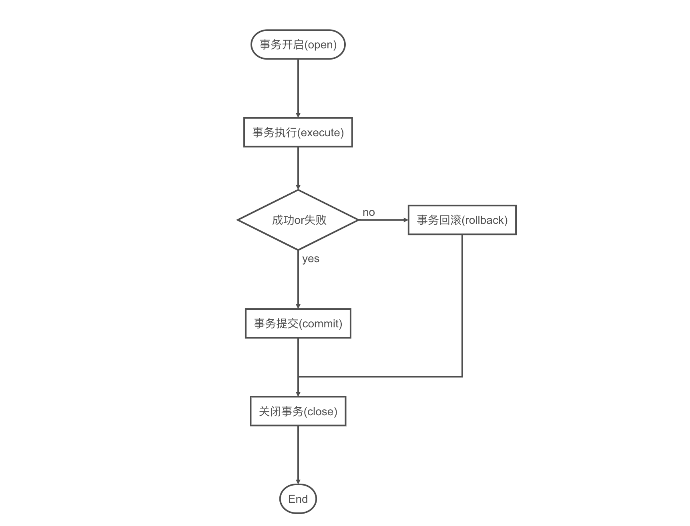

### 基于SpringBoot的Spring SpringMVC Mybatis
---
### Spring 
* [思维导图](https://upload-images.jianshu.io/upload_images/1932449-7ad2dbd931446eaa.png?imageMogr2/auto-orient/strip|imageView2/2/w/1200/format/webp)
#### Spring IOC
   * **定义**
        * **控制反转:** 把对象的创建交给Spring管理,不使用new的方式,也不使用工厂模式 
   * **原理**
        * xml配置文件
        * dom4j解析xml文件
        * 工厂设计模式
        * 反射
   * **使用**
        * 配置文件方式
        * 注解方式
   * **[bean管理(使用对象)](https://github.com/Cynaith/SpringDemo/blob/master/notebook/Spring/SpringBean.md)** 
   * **IOC与DI区别**
        * **IOC:** 控制反转,把对象创建交给spring进行配置
        * **DI:** 依赖注入,向类里面的属性中设置值
        * **关系:** 依赖注入不能单独存在，需要在ioc基础之上完成操作
#### Spring AOP
* **定义**
    * **面向切面编程:** 采用横向抽取机制,代替了传统的纵向继承体系重复性代码,不需修改原代码,实现功能扩展
* **原理**
    * **动态代理**
        * **有接口:** 使用jdk动态代理
        * **无接口:** 使用cglib动态代理
* **[术语](https://github.com/Cynaith/SpringDemo/blob/master/notebook/Spring/SpringAopTerm.md)** 
* **[AOP操作](https://github.com/Cynaith/SpringDemo/tree/master/src/main/java/com/ly/springdemo/AOP)**
#### Spring的事务管理
* **特性**
    * **原子性:** 事务应该当作一个单独单元的操作,整个序列操作要么是成功的,要么是失败的
    * **一致性:** 表示数据库的引用完整性的一致性,表中唯一的主键等
    * **隔离型:** 可能同时处理很多有相同的数据集的事务,每个事务应当和其他事务隔离,以防止数据损坏
    * **持久性:** 一个事务一旦完成全部操作后,这个事务的结果必须是永久性的,不能因系统故障而从数据库删除
* **基本流程**
    
* **事务隔离级别**
    * **TransactionDefinition.ISOLATION_DEFAULT:** 使用后端数据库默认的隔离界别，MySQL默认采用的REPEATABLE_READ隔离级别，Oracle默认采用的READ_COMMITTED隔离级别
    * **TransactionDefinition.ISOLATION_READ_UNCOMMITTED:** 最低的隔离级别，允许读取，允许读取尚未提交的的数据变更，可能会导致脏读、幻读或不可重复读
    * **TransactionDefinition.ISOLATION_READ_COMMITTED:** 允许读取并发事务已经提交的数据，可以阻止脏读，但是幻读或不可重复读仍有可能发生
    * **TransactionDefinition.ISOLATION_REPEATABLE_READ:** 对同一字段的多次读取结果都是一致的，除非数据是被本身事务自己所修改，可以阻止脏读和不可重复读，但幻读仍有可能发生
    * **TransactionDefinition.ISOLATION_SERIALIZABLE:** 最高的隔离级别，完全服从ACID的隔离级别。所有的事务依次逐个执行，这样事务之间就完全不可能产生干扰，也就说，该级别可以阻止脏读、不可重复读以及幻读。但是这将严重影响程序的性能。通常情况下也不会用到该级别
* **类型**
    * 编程式事务
    * **声明式事务**
        * 是建立在AOP之上的。其本质是对方法前后进行拦截，然后在目标方法开始之前创建或者加入一个事务，在执行完目标方法之后根据执行情况提交或者回滚事务。声明式事务最大的优点就是不需要通过编程的方式管理事务，这样就不需要在业务逻辑代码中掺杂事务管理的代码，只需在配置文件中做相关的事务规则声明(或通过基于@Transactional注解的方式)，便可以将事务规则应用到业务逻辑中
    

---
#### Spring MVC
* [引入依赖](https://github.com/Cynaith/SpringDemo/blob/master/pom.xml)
* [URL映射到方法](https://github.com/Cynaith/SpringDemo/blob/master/notebook/SpringMVC/UrlToFunction.md)
* [方法参数](https://github.com/Cynaith/SpringDemo/blob/master/notebook/SpringMVC/FunctionParameter.md)
* [验证框架](https://github.com/Cynaith/SpringDemo/blob/master/notebook/SpringMVC/VerificationFramework.md)
* [WebMvcConfig](https://github.com/Cynaith/SpringDemo/blob/master/notebook/SpringMVC/WebMvcConfigure.md)
* [视图技术](https://github.com/Cynaith/SpringDemo/blob/master/notebook/SpringMVC/View.md)
* [通用错误处理](https://github.com/Cynaith/SpringDemo/blob/master/notebook/SpringMVC/GeneralErrorHandling.md)
* [@Service和Transactional](https://github.com/Cynaith/SpringDemo/blob/master/notebook/SpringMVC/ServiceAndTransactional.md)
* ~~curl命令~~

---
#### Mybatis

* [Mybatis入门](https://github.com/Cynaith/SpringDemo/blob/master/notebook/Mybatis/MybatisInit.md)
~~* Mybatis XML方式基本用法~~
~~* Mybatis注解方式的基本用法~~
* [Mybatis动态SQL](https://github.com/Cynaith/SpringDemo/blob/master/notebook/Mybatis/DynamicSQL.md)
* Mybatis代码生成器
* Mybatis高级查询
* Mybatis缓存配置
* Mybatis插件开发
* Spring 集成Mybatis
* Spring Boot集成Mybatis

---

- SpringBoot启动后输出字符: resources下创建banner.txt 字母转字符:[http://patorjk.com/software/taag/#p=display&f=Graffiti&t=Type%20Something%20](http://patorjk.com/software/taag/#p=display&f=Graffiti&t=Type%20Something%20)
